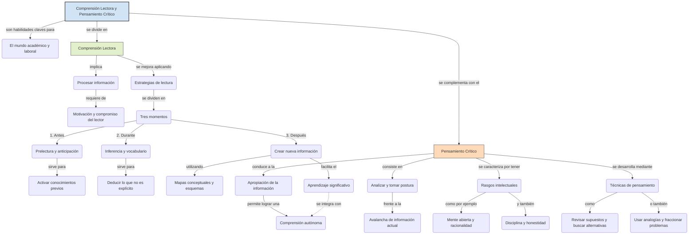

```mermaid
graph TD
    A[Comprensión Lectora y Pensamiento Crítico] -- son habilidades claves para --> B(El mundo académico y laboral)
    A -- se divide en --> C[Comprensión Lectora]
    A -- se complementa con el --> D[Pensamiento Crítico]
    
    C -- implica --> E(Procesar información)
    E -- requiere de --> F(Motivación y compromiso del lector)
    C -- se mejora aplicando --> G(Estrategias de lectura)
    
    G -- se dividen en --> H(Tres momentos)
    H -- 1. Antes --> I(Prelectura y anticipación)
    I -- sirve para --> J(Activar conocimientos previos)
    
    H -- 2. Durante --> K(Inferencia y vocabulario)
    K -- sirve para --> L(Deducir lo que no es explícito)
    
    H -- 3. Después --> M(Crear nueva información)
    M -- utilizando --> N(Mapas conceptuales y esquemas)
    M -- facilita el --> O(Aprendizaje significativo)
    
    D -- consiste en --> P(Analizar y tomar postura)
    P -- frente a la --> Q(Avalancha de información actual)
    
    D -- se caracteriza por tener --> R(Rasgos intelectuales)
    R -- como por ejemplo --> S(Mente abierta y racionalidad)
    R -- y también --> T(Disciplina y honestidad)
    
    D -- se desarrolla mediante --> U(Técnicas de pensamiento)
    U -- como --> V(Revisar supuestos y buscar alternativas)
    U -- o también --> W(Usar analogías y fraccionar problemas)
    
    D -- conduce a la --> X(Apropiación de la información)
    X -- permite lograr una --> Y(Comprensión autónoma)

    %% Conexión entre ambas áreas
    O -.->|se integra con| Y

    %% Estilos simples y limpios
    style A fill:#D0E4F5,stroke:#333,stroke-width:2px
    style C fill:#E2F0CB,stroke:#333
    style D fill:#FFDAB9,stroke:#333
```
