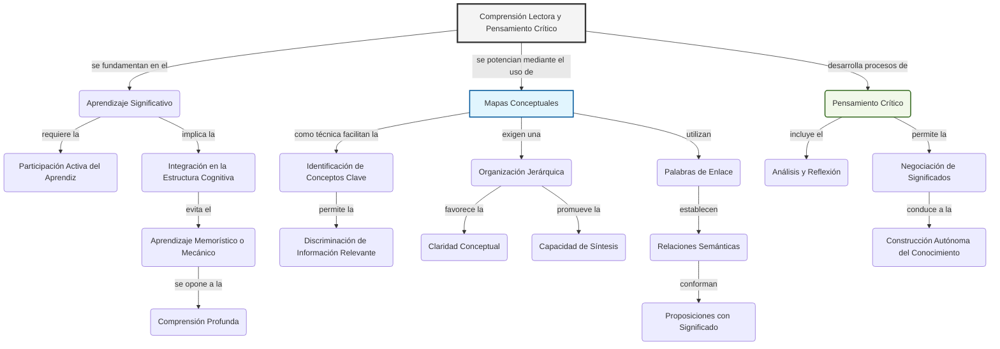

```mermaid
graph TD
    A[Comprensión Lectora y Pensamiento Crítico] -- se fundamentan en el --> B(Aprendizaje Significativo)
    B -- requiere la --> C(Participación Activa del Aprendiz)
    B -- implica la --> D(Integración en la Estructura Cognitiva)
    
    A -- se potencian mediante el uso de --> E[Mapas Conceptuales]
    
    E -- como técnica facilitan la --> F(Identificación de Conceptos Clave)
    F -- permite la --> G(Discriminación de Información Relevante)
    
    E -- exigen una --> H(Organización Jerárquica)
    H -- favorece la --> I(Claridad Conceptual)
    H -- promueve la --> J(Capacidad de Síntesis)
    
    E -- utilizan --> K(Palabras de Enlace)
    K -- establecen --> L(Relaciones Semánticas)
    L -- conforman --> M(Proposiciones con Significado)
    
    A -- desarrolla procesos de --> N(Pensamiento Crítico)
    N -- incluye el --> O(Análisis y Reflexión)
    N -- permite la --> P(Negociación de Significados)
    P -- conduce a la --> Q(Construcción Autónoma del Conocimiento)
    
    D -- evita el --> R(Aprendizaje Memorístico o Mecánico)
    R -- se opone a la --> S(Comprensión Profunda)

    %% Estética profesional
    style A fill:#f4f4f4,stroke:#333,stroke-width:3px
    style E fill:#e1f5fe,stroke:#01579b,stroke-width:2px
    style N fill:#f1f8e9,stroke:#33691e,stroke-width:2px
```
